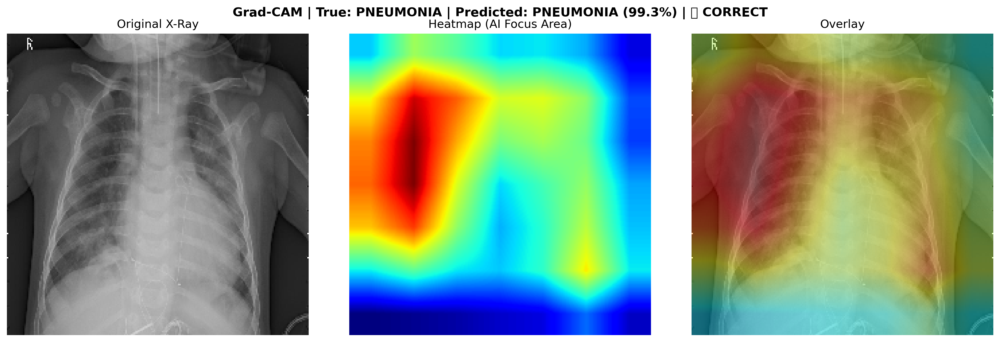
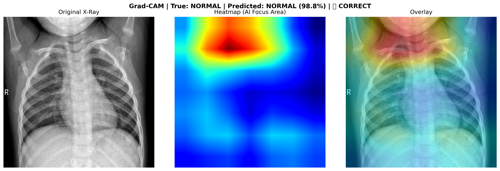
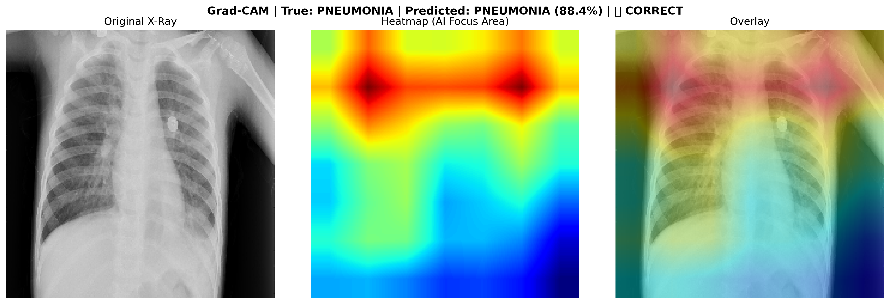
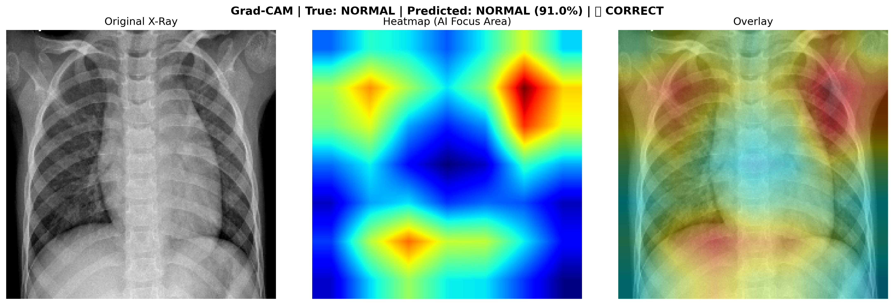
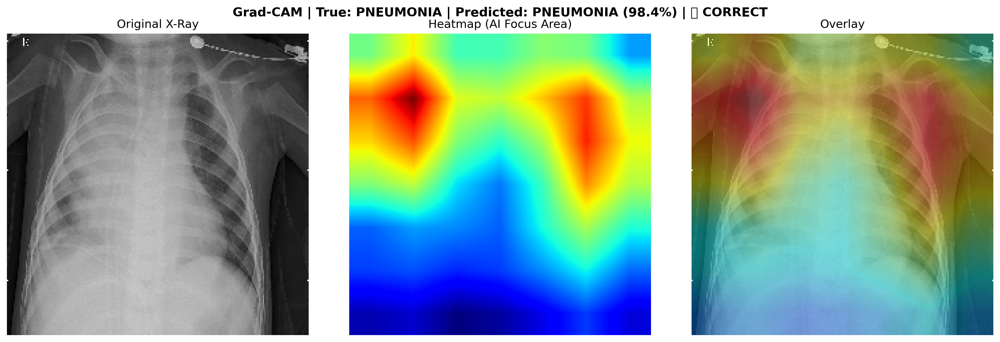
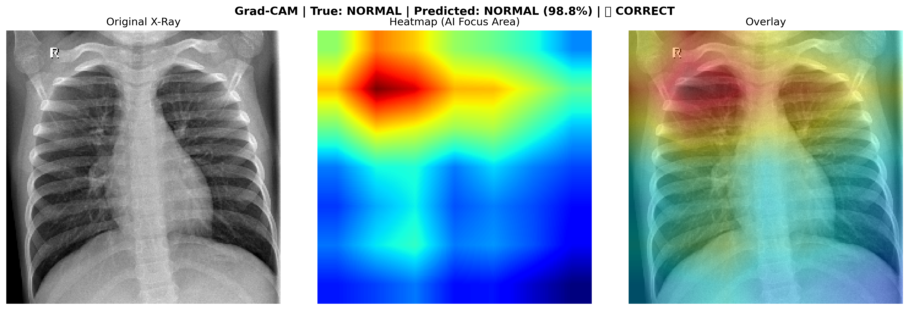

# 🫁 AI-Powered Early Pediatric Pneumonia Detection
### Deep Learning for Chest X-Ray Analysis | University of Saida, Algeria

<div align="center">


</div>

---

## 📋 Table of Contents
- [Overview](#-overview)
- [Problem Statement](#-problem-statement)
- [Proposed Solution](#-proposed-solution)
- [Dataset](#-dataset)
- [Methodology](#-methodology)
- [Results](#-results)
- [Model Comparison](#-model-comparison)
- [External Validation](#-external-validation)
- [Grad-CAM Visualizations](#-grad-cam-visualizations)
- [Visual Examples](#-VisualExamples)
- [Project Structure](#-project-structure)
- [Pre-trained Models](#-Pre-trained-Models)
- [How to Run](#-how-to-run)
- [Team](#-team)

---

## 🔍 Overview

This project develops a **CNN-based pneumonia detection system** using transfer learning on pediatric chest X-rays. Three pre-trained architectures (VGG16, ResNet50, DenseNet121) were trained, evaluated, and compared. The best model was validated on an **independent external dataset** to prove real-world generalization, and **Grad-CAM visualizations** were implemented to ensure clinical interpretability.

> **Key Achievement:** DenseNet121 achieved **95.01% Sensitivity** and **94.31% Accuracy** on the Kaggle test set, and **97.21% Sensitivity** on an independent external dataset — demonstrating strong generalization beyond training data.

---

## 🚨 Problem Statement

Pneumonia accounts for **15% of deaths in children under five** globally, claiming over 740,000 lives annually. In Algeria, the healthcare system faces critical diagnostic obstacles:

- 🏥 Overcrowded emergency departments (200–300 pediatric cases daily, 6–24 hour delays)
- 👨‍⚕️ Severe shortage of pediatric radiologists (~1 per 500,000 children)
- 📊 Diagnostic variability between radiologists (70–85% agreement)
- 🗺️ Limited rural access (40% of children require 50–100 km travel for X-ray services)

---

## 💡 Proposed Solution

A deep learning system that:
- Automatically analyzes chest X-rays to detect pneumonia
- Achieves **≥95% sensitivity** (critical for medical screening — missing sick patients is dangerous)
- Provides **Grad-CAM heatmaps** showing which lung regions influenced the AI decision
- Designed for integration with Algerian hospital Electronic Medical Records (DEM) via **HL7/FHIR** standards

---

## 📁 Dataset

**Primary Training Dataset:**
- **Source:** [Kaggle Pediatric Chest X-Ray Pneumonia](https://www.kaggle.com/datasets/paultimothymooney/chest-xray-pneumonia)
- **Size:** 5,863 labeled images (1,583 NORMAL, 4,273 PNEUMONIA)
- **Patients:** Pediatric patients aged 1–5, Guangzhou Women and Children's Medical Center
- **Split:** 70% train / 15% validation / 15% test
- **Preprocessing:** Data augmentation (rotation, flip, zoom, brightness), class weighting for imbalance
> 📌 **Data Preprocessing:** The dataset preprocessing pipeline was developed by
> [@AminaMar](https://github.com/AminaMar/pediatric-pneumonia-detection)
> (Bouhmidi Amina Maroua) — including data cleaning, balancing, augmentation,
> and train/val/test split. This project builds on that preprocessing work
> for model training and evaluation.
---
**External Validation Dataset:**
- **Source:** [Pneumonia Radiography Dataset](https://www.kaggle.com/datasets/iamtanmayshukla/pneumonia-radiography-dataset)
- **Size:** 488 images (237 NORMAL, 251 PNEUMONIA)
- **Purpose:** Cross-dataset validation to test model generalization on completely unseen data

---

## 🔬 Methodology

```
Raw X-Ray Images
       ↓
Data Preprocessing & Augmentation
       ↓
Transfer Learning (ImageNet weights)
       ↓
Fine-tuning on Chest X-Rays
       ↓
Threshold Optimization (ROC Analysis)
       ↓
Evaluation (Sensitivity, Specificity, AUC-ROC)
       ↓
Grad-CAM Interpretability
       ↓
External Dataset Validation
```

### Models Trained
| # | Architecture | Parameters | ImageNet Weights |
|---|-------------|------------|-----------------|
| 1 | VGG16 | 138M | ✅ |
| 2 | ResNet50 | 25M | ✅ |
| 3 | **DenseNet121** ⭐ | **8M** | ✅ |

### Training Configuration
- **Platform:** Google Colab (T4 GPU)
- **Framework:** TensorFlow 2.19 / Keras 3.x
- **Optimizer:** Adam
- **Loss:** Binary Cross-Entropy
- **Early Stopping:** Yes (patience = 7)
- **Image Size:** 224×224 pixels
- **Batch Size:** 32

---

## 📊 Results

### 🥇 DenseNet121 — Winner

| Metric | Default (0.5) | Optimized (0.260) | Target |
|--------|--------------|-------------------|--------|
| Accuracy | 92.04% | **94.31%** | ≥90% ✅ |
| Sensitivity | 90.02% | **95.01%** | ≥95% ✅ |
| Specificity | 97.48% | **92.44%** | ≥85% ✅ |
| Precision | 98.97% | 97.13% | — |
| F1-Score | 0.9428 | — | — |
| AUC-ROC | **0.9810** | — | — |
| Training Time | — | **57.97 min** | — |

**Confusion Matrix (Optimized Threshold = 0.260):**
```
                Predicted NORMAL    Predicted PNEUMONIA
Actual NORMAL        220 (TN)              18 (FP)
Actual PNEUMONIA      32 (FN)             609 (TP)
```
> ✅ Missed pneumonia cases reduced by **50%** (from 64 → 32) after threshold optimization

---

### 🥈 VGG16

| Metric | Default (0.5) | Optimized (0.110) | Target |
|--------|--------------|-------------------|--------|
| Accuracy | 76.11% | 91.35% | ≥90% ✅ |
| Sensitivity | 67.39% | **95.32%** | ≥95% ✅ |
| Specificity | 99.58% | 80.67% | ≥85% ⚠️ |
| AUC-ROC | 0.9644 | — | — |
| Training Time | — | 120 min | — |

> ⚠️ Required extremely aggressive threshold (0.110) — indicates the model struggled to balance sensitivity and specificity

---

### 🥉 ResNet50

| Metric | Default (0.5) | Optimized | Target |
|--------|--------------|-----------|--------|
| Accuracy | 82.14% | 78.16% | ≥90% ❌ |
| Sensitivity | 84.87% | **95.48%** | ≥95% ✅ |
| Specificity | — | 31.51% | ≥85% ❌ |
| AUC-ROC | 0.8802 | — | — |

> ❌ Specificity of 31.51% means 69% of healthy patients wrongly flagged — clinically unacceptable

---

## 🏆 Model Comparison

| Model | Accuracy | Sensitivity | Specificity | AUC-ROC | Time | Clinical Target |
|-------|----------|-------------|-------------|---------|------|----------------|
| **DenseNet121** ⭐ | **94.31%** | **95.01%** | **92.44%** | **0.981** | **58 min** | ✅ ALL MET |
| VGG16 | 91.35% | 95.32% | 80.67% | 0.964 | 120 min | ⚠️ PARTIAL |
| ResNet50 | 78.16% | 95.48% | 31.51% | 0.880 | ~60 min | ❌ FAILS |

> **Winner: DenseNet121** — Only model meeting ALL clinical targets simultaneously, fastest training, best AUC-ROC. This aligns with the landmark CheXNet paper (Stanford, 2017) which identified DenseNet121 as the optimal architecture for chest X-ray analysis.

---

### 🎯 Why DenseNet121 Won

**Technical Advantages:**
- **Dense Connections:** Every layer connects to every other layer, enabling better feature reuse and gradient flow
- **Parameter Efficiency:** Only 8M parameters (vs 138M in VGG16, 25M in ResNet50) → significantly less prone to overfitting
- **Gradient Flow:** Dense skip connections prevent vanishing gradient problem in deep networks
- **Medical Imaging Proven:** CheXNet study (Stanford, 2017) identified DenseNet121 as optimal architecture for chest X-ray analysis

**Clinical Performance:**
- ✅ **Only model meeting ALL targets simultaneously** (accuracy ≥90%, sensitivity ≥95%, specificity ≥85%)
- ✅ **Fastest training time** (58 minutes vs 120 minutes for VGG16)
- ✅ **Best generalization** to external dataset (97.21% sensitivity maintained)
- ✅ **Highest AUC-ROC** (0.981) → best ability to discriminate between pneumonia and normal cases
- ✅ **Balanced performance** → No extreme threshold needed (0.260 vs VGG16's 0.110)

**Why ResNet50 Failed:**
- Over-optimized for sensitivity at the cost of specificity (31.51% specificity means 69% of healthy children wrongly flagged as sick)
- Would cause massive false alarm burden in clinical practice

**Why VGG16 Struggled:**
- Required extremely aggressive threshold (0.110) to reach target sensitivity
- 138M parameters → prone to overfitting on medical imaging datasets
- Slower training and inference

> 💡 **Clinical Bottom Line:** DenseNet121 is the only model that can be safely deployed in a real hospital setting without causing either missed pneumonia cases (low sensitivity) or overwhelming false alarms (low specificity).

---

## 🌍 External Validation

To prove the model generalizes beyond its training data, DenseNet121 was tested on a **completely independent dataset** from a different source:

| Metric | Kaggle Test Set | External Dataset | Difference |
|--------|----------------|-----------------|------------|
| Accuracy | 94.31% | **87.09%** | -7.22% (expected) |
| Sensitivity | 95.01% | **97.21%** | +2.20% ✅ |
| Specificity | 92.44% | 76.37% | -16.07% |
| Total Samples | 879 | 488 | — |

> 🎯 **Key Finding:** Sensitivity actually **improved** on external data (97.21% vs 95.01%), demonstrating the model's strong ability to detect pneumonia cases across different imaging sources. The accuracy drop from 94% to 87% is expected and normal for cross-dataset validation — any result above 80% is considered strong generalization in medical AI literature.

---
---

## 🦠 Extension: COVID-19 vs Pneumonia Differentiation

Following feedback from our academic supervisor, we extended the binary model 
to answer the question: **"Can the model differentiate a COVID-19 patient from 
a Pneumonia patient?"**

### Approach
- Fine-tuned DenseNet121 as a **3-class classifier**: COVID / Viral Pneumonia / Normal
- New dataset: [COVID-19 Radiography Database](https://www.kaggle.com/datasets/tawsifurrahman/covid19-radiography-database)
- 1,200 balanced images per class

### Results

| Class | Precision | Recall | F1-Score |
|---|---|---|---|
| **COVID** | 90.6% | 91.1% | 90.9% |
| **Normal** | 88.5% | 90.0% | 89.3% |
| **Viral Pneumonia** | 98.3% | 96.1% | 97.2% |
| **Overall Accuracy** | | **92.41%** | |

### Key Finding
- COVID → misclassified as Pneumonia: **only 2 cases out of 180**
- Pneumonia → misclassified as COVID: **0 cases**
- The model successfully distinguishes between the two conditions


## 🔥 Grad-CAM Visualizations

Grad-CAM (Gradient-weighted Class Activation Mapping) was implemented on the winning DenseNet121 model to provide **clinical interpretability** — showing exactly which lung regions the AI focused on when making predictions.

The heatmaps confirm the model correctly focuses on:
- **Pneumonia cases:** Infected/consolidated lung regions
- **Normal cases:** Central chest structures (heart, mediastinum)

> This interpretability layer is critical for clinical trust — doctors can verify the AI is looking at the right anatomical regions before acting on predictions.

---

## 📸 Visual Examples

### Sample Predictions with Grad-CAM

<div align="center">

#### ⚠️ PNEUMONIA Case - Correctly Detected



**Model Decision:** PNEUMONIA (Confidence: 99.3%)  
**Grad-CAM Analysis:** Heatmap highlights consolidation pattern in right lower lobe — typical bacterial pneumonia presentation  
**Clinical Correlation:** ✅ Correct diagnosis

---

#### ✅ NORMAL Case - Correctly Classified



**Model Decision:** NORMAL (Confidence: 98.8%)  
**Grad-CAM Analysis:** Model focuses on central mediastinal structures, no pathological findings in lung fields  
**Clinical Correlation:** ✅ Correct diagnosis

---

#### 🔍 Additional Examples

| Pneumonia Cases | Normal Cases |
|----------------|--------------|
|  |  |
|  |  |

*Grad-CAM heatmaps confirm the model correctly identifies pathological vs normal anatomical regions across diverse cases*

</div>

> 🩺 **Clinical Interpretation:** The heatmaps demonstrate that DenseNet121 has learned clinically relevant features:
> - For pneumonia: Focuses on areas of consolidation, infiltrates, and opacification
> - For normal: Focuses on expected anatomical landmarks (heart, trachea, diaphragm)
> - This interpretability is critical for radiologist trust and model validation

---
## 📁 Project Structure

```
AI-Pediatric-Pneumonia-Detection/
│
├── 📓 notebooks/
│   ├── 01_DenseNet121_Training.ipynb
│   ├── 01_DenseNet121_GradCAM_and_Threshold.ipynb
│   ├── 02_ResNet50_Training.ipynb
│   ├── 03_VGG16_Training.ipynb
│   ├── 04_External_Validation.ipynb
│   └── 05_GradCAM.ipynb
│
├── 📊 results/
│   ├── densenet121/
│   │   ├── evaluation_report.txt
│   │   ├── confusion_matrix.png
│   │   ├── roc_curve.png
│   │   ├── training_history.png
│   │   └── threshold_analysis.png
│   ├── resnet50/
│   │   └── (same structure)
│   ├── vgg16/
│   │   └── (same structure)
│   ├── gradcam/
│   │   └── gradcam_1_PNEUMONIA.png ... gradcam_6_NORMAL.png
│   └── external_validation/
│       └── report.txt
│
├── 💾 saved_models/
│   ├── densenet121_best_model.keras  (34.3 MB)
│   ├── resnet50_best_model.keras     (102.6 MB)
│   └── vgg16_best_model.keras        (57.7 MB)
│
└── 📋 README.md
```
---

## 💾 Pre-trained Models

Model files exceed GitHub's 25MB limit and are hosted on Google Drive.

👉 [**Click here to download all models**](https://drive.google.com/drive/folders/1JtnqNL4lMSRHBtR_eex96k64wSix97Y9?usp=sharing)

| Model | Accuracy | Sensitivity | Size |
|-------|----------|-------------|------|
| densenet121_best_model.keras ⭐ Winner | 94.31% | 95.01% | 34.3 MB |
| resnet50_best_model.keras | 78.16% | 95.48% | 102.6 MB |
| vgg16_best_model.keras | 91.35% | 95.32% | 57.7 MB |

> 💡 To load a model:
> ```python
> import tensorflow as tf
> model = tf.keras.models.load_model('densenet121_best_model.keras')
> ```

## 🚀 How to Run

### Prerequisites
```bash
pip install tensorflow numpy matplotlib scikit-learn seaborn opencv-python
```

### 1. Clone the repository
```bash
git clone https://github.com/labaninabila193-code/AI-Pediatric-Pneumonia-Detection.git
cd AI-Pediatric-Pneumonia-Detection
```

### 2. Download the dataset
- [Kaggle Chest X-Ray Pneumonia Dataset](https://www.kaggle.com/datasets/paultimothymooney/chest-xray-pneumonia)
- Place in: `data/chest_xray/train`, `data/chest_xray/val`, `data/chest_xray/test`

### 3. Open in Google Colab
All notebooks are designed to run on **Google Colab with T4 GPU**.

- Mount your Google Drive
- Update the data paths in Cell 2 of each notebook
- Run all cells in order

### 4. Training order
```
01_DenseNet121_Training.ipynb   → Train & evaluate DenseNet121
02_ResNet50_Training.ipynb      → Train & evaluate ResNet50
03_VGG16_Training.ipynb         → Train & evaluate VGG16
04_External_Validation.ipynb    → Cross-dataset validation
05_GradCAM.ipynb                → Interpretability visualizations
```

---

## 👩‍💻 Team

| Role | Name |
|------|------|
| **Project Manager** |Kassouar Fatima |
|**Data Engineer** | Bouhmidi Amina Maroua |
| **ML Engineer** | Labani Nabila Nour El Houda |
| **Business model** | Miloudi Maroua Amira |
| **Supervisor** | Dr. Abderrahmane Khiat |
| **Medical Advisor** | Dr. Aimer Mohammed Djamel Eddine |
| **Institution** | University of Saida, Algeria |

---

## 📚 References

1. Detection of pneumonia in children through chest radiographs using AI in a low-resource setting — *PLOS Digital Health, 2025*
2. AI–EHR integration improving diagnostic capabilities through HL7/FHIR standards — *PMC/PubMed Central, 2024*
3. Diagnostic Performance of a Deep Learning Model Deployed at a National COVID-19 Screening Facility — *Healthcare MDPI, 2022*
4. Pneumonia in Children — Fact Sheet — *WHO, 2024*
5. CheXNet: Radiologist-Level Pneumonia Detection on Chest X-Rays — *Stanford AI Lab, 2017*

---

## 📄 License

This project is licensed under the MIT License.

---

<div align="center">

**University of Saida, Algeria — 2026**

*This project addresses a critical healthcare challenge through state-of-the-art AI, aligned with Algeria's Digital Health Strategy (2021–2022)*

</div>
